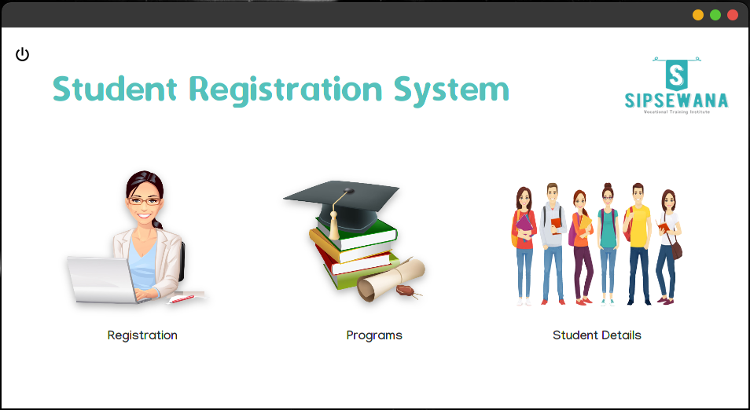
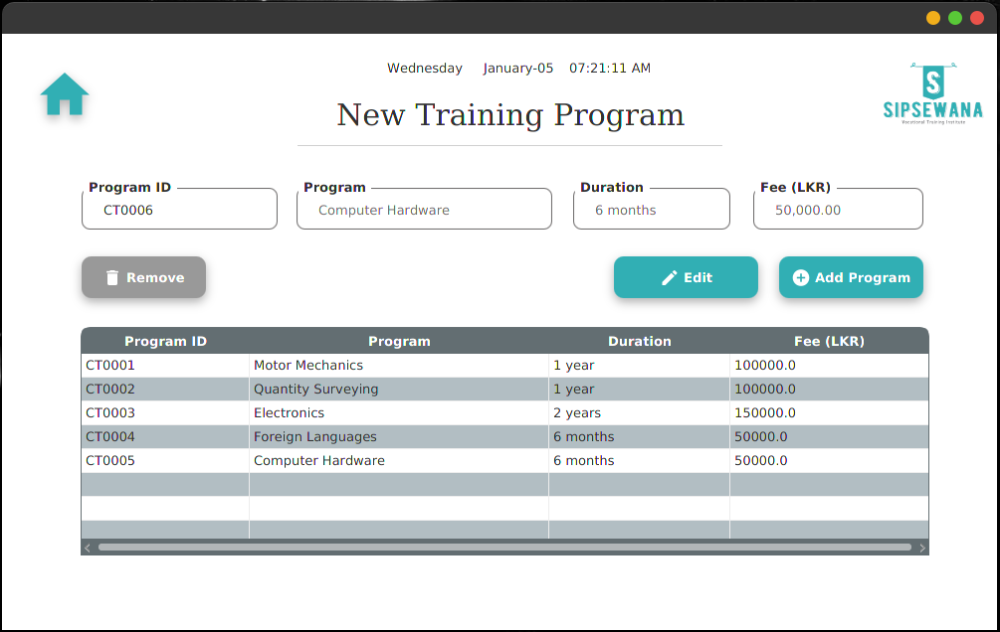

# **Student Registration System for Sipsewana Institute**

The Sipsewana institute is a prominent institute that provides different types of vocational training programs for the youth in Sri Lanka. The institute was established a few decades ago and now accommodates about 5000 students per year.

In this institute, the student registration process was done manually so far by keeping records on physical files so far since its establishment. However, as the number of students keeps increasing day by day, management is facing more and more problems regarding keeping records of the students and the course programs.

This application was implemented to simplify the registration process.

##

## **Technologies used:**

    JavaFx
    JPA Hibernate

##

## **Architecture used:**

    Layered Architecture
    
 

  
  
  
  

